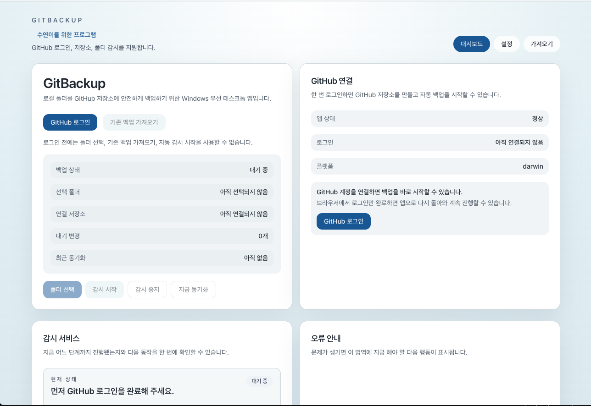
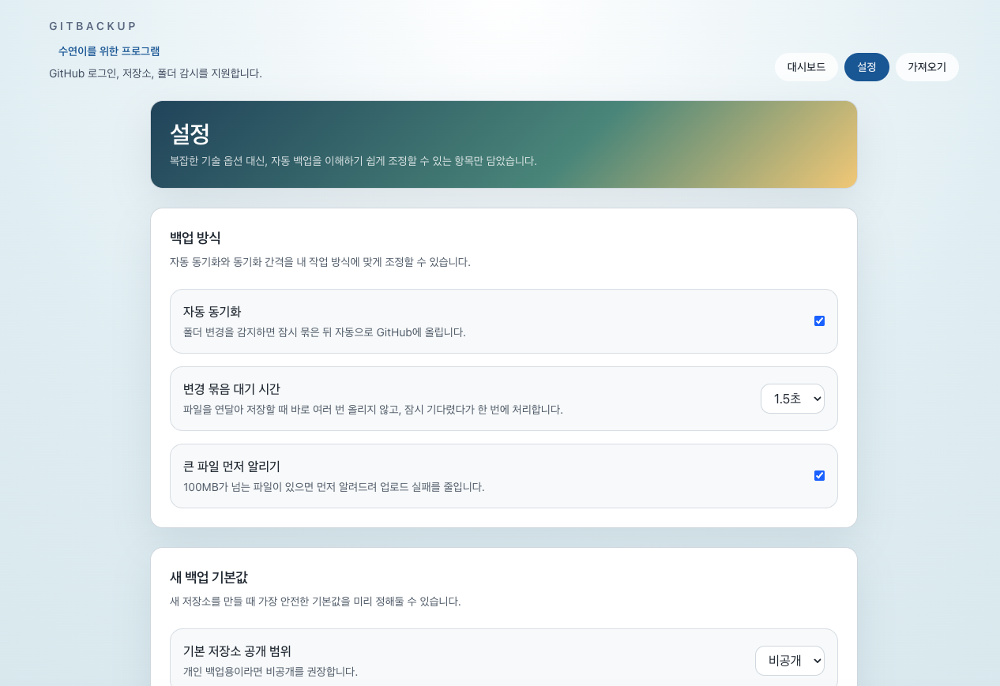
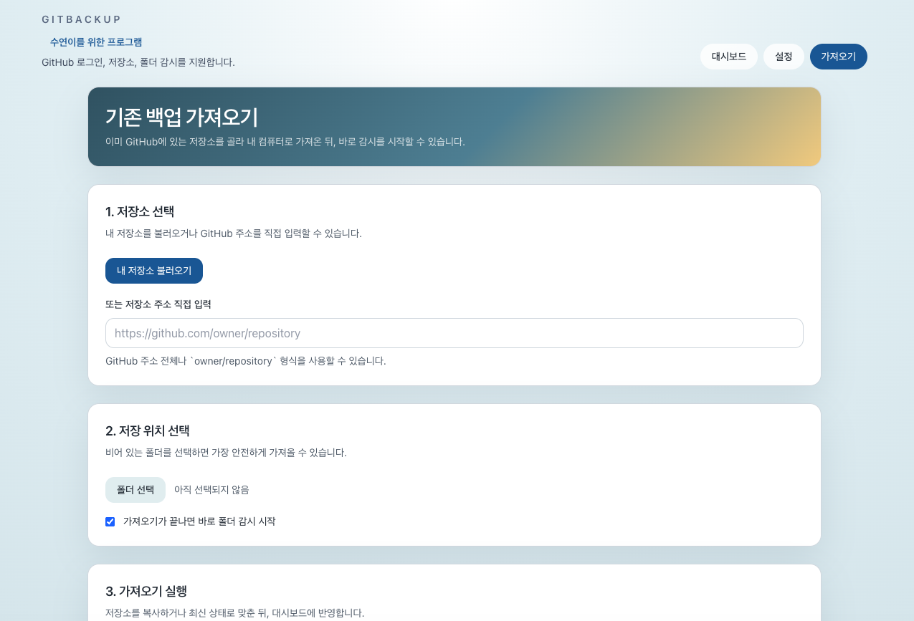

# GitBackup Windows 설치 및 사용 가이드

GitBackup은 **내 컴퓨터의 폴더를 GitHub 저장소에 안전하게 백업**할 수 있도록 돕는 Windows용 데스크톱 앱입니다.  
이 문서는 **처음 설치하는 사용자**가 설치부터 로그인, 첫 백업 준비, 기존 백업 가져오기까지 한 번에 진행할 수 있도록 구성했습니다.

---

## 문서에서 다루는 내용

- 프로그램 설치
- GitHub 계정 연결
- 대시보드 화면 이해
- 자동 백업 설정 방법
- 기존 GitHub 백업 가져오기
- 사용 중 자주 확인할 항목
- 문제 발생 시 점검 포인트

---

## 1. 시작 전에 준비할 것

GitBackup을 사용하려면 아래 항목이 필요합니다.

- **Windows PC**
- **인터넷 연결**
- **GitHub 계정**
- 백업할 **로컬 폴더**

> GitBackup은 GitHub 로그인 후 저장소를 만들거나 기존 저장소를 가져와 백업을 이어갈 수 있습니다.

---

## 2. 설치 파일 다운로드

배포 페이지에서 **Windows용 설치 파일(`.exe`)**을 다운로드합니다.

예시:
- `GitBackup-Setup-x.x.x.exe`

버전에 따라 파일 이름은 달라질 수 있습니다.

> 다운로드한 파일은 공식 배포 경로에서 받은 설치 파일인지 먼저 확인하세요.

---

## 3. 설치하기

1. 다운로드한 `.exe` 파일을 실행합니다.
2. 설치 위치를 확인합니다.
3. 설치를 진행합니다.
4. 설치가 완료되면 **GitBackup**을 실행합니다.

### 설치 중 참고
- Windows 보안 경고가 표시될 수 있습니다.
- 이 경우 파일 출처가 **공식 배포본**인지 먼저 확인한 뒤 진행하세요.

---

## 4. 첫 실행 화면 이해하기

앱을 실행하면 상단에서 아래 메뉴를 볼 수 있습니다.

- `대시보드`
- `설정`
- `가져오기`

기본적으로는 **대시보드**에서 현재 상태를 확인하고,  
필요한 설정은 **설정**, 기존 저장소를 연결할 때는 **가져오기** 화면을 사용합니다.

---

## 5. 가장 먼저 해야 할 일: GitHub 로그인

GitBackup의 핵심 기능은 GitHub 계정 연결 후 사용할 수 있습니다.

### 로그인 방법

1. 대시보드에서 `GitHub 로그인` 버튼을 누릅니다.
2. 브라우저가 열리면 GitHub 로그인과 연결 승인을 진행합니다.
3. 인증이 끝나면 앱으로 돌아옵니다.
4. 대시보드의 `GitHub 연결` 영역에서 로그인 상태를 확인합니다.

### 로그인 전에는 사용할 수 없는 기능
로그인 전에는 아래 기능을 사용할 수 없습니다.

- 폴더 선택
- 기존 백업 가져오기
- 자동 감시 시작
- 즉시 동기화

> 화면에 “먼저 GitHub 로그인을 완료해 주세요.”와 같은 안내가 보이면, 먼저 계정 연결을 완료하면 됩니다.

---

## 6. 대시보드에서 확인하는 항목

대시보드는 현재 백업 상태를 한눈에 확인하는 화면입니다.

### 6.1 왼쪽 영역: 현재 백업 상태
다음 정보를 확인할 수 있습니다.

- **백업 상태**: 현재 대기 중인지, 감시 중인지 표시
- **선택 폴더**: 백업 대상으로 지정한 폴더
- **연결 저장소**: 현재 연결된 GitHub 저장소
- **대기 변경**: 아직 업로드되지 않은 변경 개수
- **최근 동기화**: 마지막 동기화 시점

### 6.2 오른쪽 영역: GitHub 연결 상태
다음 정보를 확인할 수 있습니다.

- **앱 상태**: 프로그램이 정상 동작 중인지
- **로그인**: GitHub 계정 연결 여부
- **플랫폼**: 현재 실행 환경

### 6.3 하단 버튼 설명

- `폴더 선택` : 백업할 로컬 폴더 지정
- `감시 시작` : 폴더 변경 감시 시작
- `감시 중지` : 자동 감시 중단
- `지금 동기화` : 대기 중인 변경을 즉시 업로드

> 일반적인 사용 흐름은 **GitHub 로그인 → 폴더 선택 → 감시 시작** 순서입니다.

---

## 7. 설정 화면에서 조정할 수 있는 항목

설정 화면에서는 자동 백업 동작 방식을 사용하기 쉽게 조정할 수 있습니다.

## 7.1 백업 방식

### 자동 동기화
폴더 변경을 감지하면 잠시 대기한 뒤 GitHub로 자동 업로드합니다.

- 켜짐: 변경이 생기면 자동 업로드
- 꺼짐: 직접 `지금 동기화`를 눌러야 반영

### 변경 묶음 대기 시간
파일이 연속으로 바뀌는 경우, 바로 여러 번 올리지 않고  
잠시 기다렸다가 **한 번에 처리**하도록 도와줍니다.

예:
- `1.5초`

짧을수록 빠르게 반영되지만 업로드 횟수가 많아질 수 있고,  
길수록 여러 변경을 묶어 안정적으로 처리할 수 있습니다.

### 큰 파일 먼저 알리기
큰 파일이 있을 때 미리 알려주어 업로드 실패 가능성을 줄입니다.

예:
- `100MB`가 넘는 파일은 GitHub 일반 업로드 정책상 문제가 될 수 있습니다.

## 7.2 새 백업 기본값

### 기본 저장소 공개 범위
새 저장소를 만들 때 기본 공개 범위를 정할 수 있습니다.

- `비공개` 권장: 개인 백업 용도
- `공개`: 외부에 공개 가능한 자료만 사용

> 일반적인 개인 백업이라면 **비공개 저장소**를 권장합니다.

---

## 8. 기존 백업 가져오기

이미 GitHub에 백업 저장소가 있다면, `가져오기` 화면에서 내 컴퓨터로 가져와 이어서 사용할 수 있습니다.

### 8.1 저장소 선택

아래 두 가지 방법 중 하나를 사용합니다.

#### 방법 A. 내 저장소 불러오기
`내 저장소 불러오기` 버튼을 눌러 GitHub 계정의 저장소 목록을 불러옵니다.

이 방식이 가장 편하고 실수 가능성이 적습니다.

#### 방법 B. 저장소 주소 직접 입력
직접 GitHub 저장소 주소를 입력할 수도 있습니다.

예:
- `https://github.com/owner/repository`
- `owner/repository`

> 가능하면 HTTPS 주소 또는 정확한 `owner/repository` 형식을 사용하세요.

### 8.2 저장 위치 선택

1. `폴더 선택` 버튼을 누릅니다.
2. 백업을 가져올 로컬 폴더를 선택합니다.

권장 사항:
- **비어 있는 폴더**를 선택하는 것이 가장 안전합니다.

### 8.3 가져오기 후 자동 감시 시작

옵션:
- `가져오기가 끝나면 바로 폴더 감시 시작`

이 항목을 켜두면 가져오기 완료 후 자동으로 감시가 시작되어  
이후 변경 사항도 바로 백업할 수 있습니다.

### 8.4 가져오기 실행

설정이 끝나면 가져오기를 실행합니다.  
가져오기가 끝나면 대시보드에 연결 상태와 현재 백업 정보가 반영됩니다.

---

## 9. 추천 사용 흐름

처음 사용하는 사용자라면 아래 순서대로 진행하면 가장 쉽습니다.

### 새로 시작하는 경우
1. 프로그램 설치
2. `GitHub 로그인`
3. `설정` 화면에서 자동 동기화 옵션 확인
4. 백업할 폴더 선택
5. 저장소 생성 또는 연결
6. `감시 시작`
7. 필요 시 `지금 동기화`

### 이미 GitHub에 백업이 있는 경우
1. 프로그램 설치
2. `GitHub 로그인`
3. `가져오기` 탭으로 이동
4. 저장소 선택 또는 주소 입력
5. 로컬 저장 위치 선택
6. 가져오기 실행
7. 필요 시 자동 감시 시작

---

## 10. 사용 중 기억하면 좋은 점

- GitHub 로그인 전에는 핵심 기능을 사용할 수 없습니다.
- 백업 대상 폴더는 내가 실제로 작업하는 폴더인지 꼭 확인하세요.
- 큰 파일은 업로드가 제한될 수 있으므로 사전에 확인하는 것이 좋습니다.
- 인터넷 속도나 GitHub 상태에 따라 동기화 시간이 길어질 수 있습니다.
- 기존 저장소를 가져올 때는 **비어 있는 폴더**를 사용하는 것이 안전합니다.
- 자동 동기화를 꺼둔 경우에는 `지금 동기화`를 눌러야 변경이 반영됩니다.

---

## 11. 자주 사용하는 버튼 정리

| 버튼 | 용도 |
|---|---|
| `GitHub 로그인` | GitHub 계정 연결 |
| `기존 백업 가져오기` | 이미 GitHub에 있는 백업 연결 |
| `폴더 선택` | 백업 또는 가져오기 대상 폴더 지정 |
| `감시 시작` | 폴더 변경 감시 시작 |
| `감시 중지` | 자동 감시 중단 |
| `지금 동기화` | 현재 변경 사항 즉시 업로드 |
| `내 저장소 불러오기` | 내 GitHub 저장소 목록 불러오기 |

---

## 12. 문제가 생기면 먼저 확인할 것

### 로그인 관련
- GitHub 로그인은 정상적으로 완료했는지
- 브라우저에서 연결 승인을 끝냈는지
- 앱으로 다시 돌아왔는지

### 동기화 관련
- 인터넷 연결이 정상인지
- GitHub 저장소가 제대로 연결되었는지
- 선택한 폴더가 올바른지
- 너무 큰 파일이 포함되어 있지 않은지

### 가져오기 관련
- 저장소 주소 형식이 올바른지
- 저장 위치로 비어 있는 폴더를 골랐는지
- 가져오기 후 감시 시작 옵션을 의도대로 선택했는지

### 화면의 안내 영역 확인
대시보드의 아래 영역도 꼭 확인하세요.

- **감시 서비스**: 지금 어느 단계인지 보여줍니다.
- **오류 안내**: 다음에 무엇을 해야 하는지 알려줍니다.

---

## 13. 로그 파일 위치

문제가 반복되면 로그 파일을 확인하면 원인을 찾는 데 도움이 됩니다.

일반적으로 로그는 아래 경로에서 확인할 수 있습니다.

`%APPDATA%\GitBackup\logs\main.log`

필요하다면 같은 폴더 안의 다른 로그 파일도 함께 확인하세요.

---

## 14. 함께 보면 좋은 문서

- [빠른 시작 가이드](/docs/quick-start.md)
- [문제 해결](/docs/troubleshooting.md)
- [자주 묻는 질문](/docs/faq.md)

---

## 부록: 화면별 핵심 목적 한눈에 보기

### 대시보드
현재 상태 확인, 로그인, 폴더 선택, 감시 시작/중지, 즉시 동기화

### 설정
자동 동기화 방식, 대기 시간, 큰 파일 알림, 기본 공개 범위 설정

### 가져오기
기존 GitHub 저장소를 로컬로 가져오고 바로 감시 시작

---

이 문서만 따라 하면 처음 설치한 뒤에도  
**GitHub 계정 연결 → 폴더 선택 → 자동 백업 시작**까지 어렵지 않게 진행할 수 있습니다.
